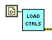

# LabVIEW control value loader and saver

Users can use these VIs to load previously saved control values.

## Changes

**2023/2/15**

- Auto creates `data/` folder for the configuration file.

- The configuration file has it identical name according to VI's name. For example: `HOST_main_config.ini`. 

## How to load configuration

Simply wire the `current VI's Path` to the input of the loader. If the configuration file does not exist, this VI creates one. 

The default location of the configuration file is `./data`. The default naming is  `[VI's name]` +`_config.ini`. Users can modify the default path and file name in the block diagram. 

Note that the *load* operation is typically run in the early stage of a program. 

## How to save configuration

You do not have to wire anything once the *loader* run. The internal FGV will take over all the stuff.

Note that the *saver* operation is typically run in the last stage of a program. 
