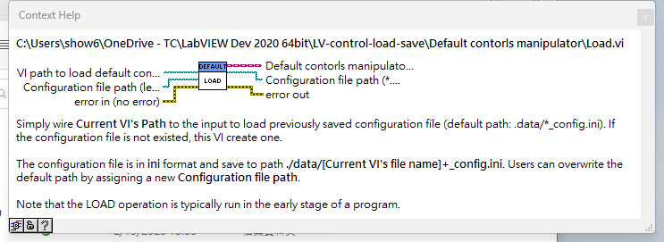
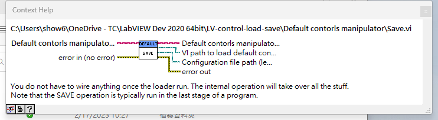

# LabVIEW control value loader and saver

Users can use these VIs to load previously saved control values.

## Changes

**2023/2/17**

* Refactor API by OOP

* Add example VIs

**2023/2/15**

- Auto creates `data/` folder for the configuration file.

- The configuration file has it identical name according to VI's name. For example: `HOST_main_config.ini`. 

## Examples

There are twe examples in the project:

* Example of default load and save.vi

* Example of default load and save by the assigned ini path.vi

## How to load configuration

Please check the VI's context help for the info.

## How to save configuration

Please check the VI's context help for the info.

